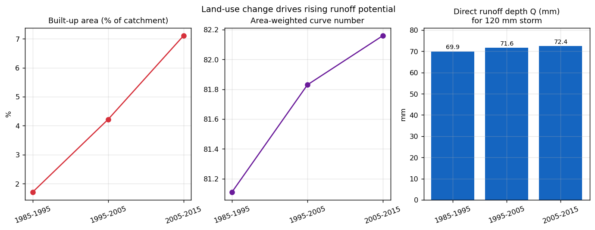
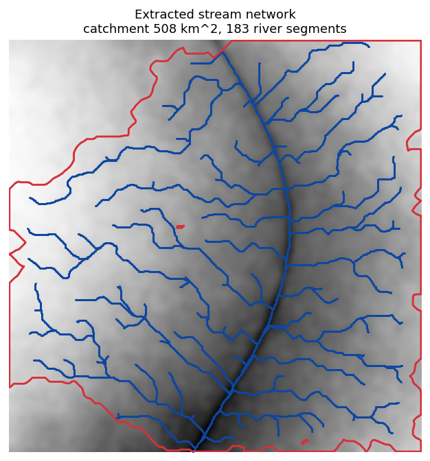
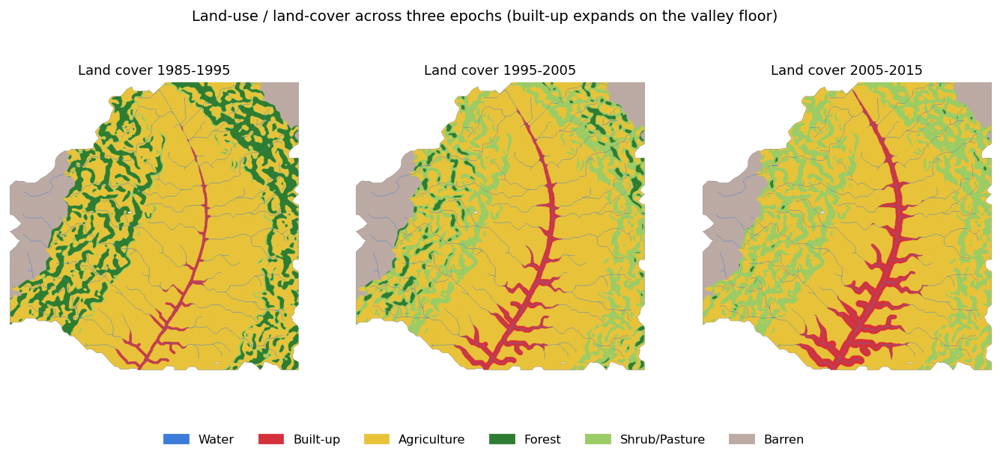

# Watershed Runoff & Land-Use Change — a reproducible SCS-CN pipeline

A small, fully reproducible Python project that delineates a watershed from a
DEM, extracts its stream network, and quantifies how **land-use change raises
surface-runoff potential** using the SCS Curve Number method.

The whole analysis runs from one command and produces the figures and results
table below.

---

> ### Scope and honesty note (read this first)
> This is a **methods demonstration inspired by** a peer-reviewed study I
> co-authored (see *Attribution* below), **not** that study or its data.
>
> - The terrain is a **synthetic, seed-reproducible DEM** — it is **not** the
>   Kodagu catchment from the publication, and the ~508 km² area, elevations,
>   and land-cover fractions are emergent properties of the generated surface.
> - The original study was built in **QGIS/QSWAT** (a GUI workflow). This
>   project re-implements the same *methods* — D8 flow routing, watershed
>   delineation, SCS Curve Number runoff — as **reproducible Python code**, so
>   anyone can run it and get identical results.
>
> In other words: the *science and methodology* trace directly to the
> publication; the *data is synthetic and the code is original*.

---

## What it does

```
DEM  →  fill/condition  →  D8 flow direction  →  flow accumulation
     →  catchment delineation  →  stream network
     →  3 land-use epochs (forest loss + built-up growth)
     →  SCS-CN runoff per epoch  →  figures + results.csv
```

## Headline result

As forest is converted to agriculture and a built-up core expands on the
valley floor across three epochs, the area-weighted curve number rises and so
does direct runoff from the same design storm — the same mechanism reported in
the source publication.

| Epoch      | Built-up % | Forest % | Weighted CN | Runoff Q (mm) |
|------------|-----------:|---------:|------------:|--------------:|
| 1985–1995  |       1.71 |    17.01 |       81.11 |          69.9 |
| 1995–2005  |       4.22 |     3.37 |       81.83 |          71.6 |
| 2005–2015  |       7.11 |     0.18 |       82.16 |          72.4 |

*(120 mm design storm. Full table with all classes in `outputs/results.csv`.)*



## Selected figures

| Stream network | Land-cover change |
|---|---|
|  |  |

## Run it

```bash
git clone <your-repo-url>
cd watershed-runoff-scs-cn
pip install -r requirements.txt
python src/run_analysis.py
```

Outputs are written to `outputs/figures/` and `outputs/results.csv`. The run is
deterministic (fixed seed), so results reproduce exactly.

## Repository layout

```
src/
  terrain.py        synthetic DEM generation
  hydrology.py      flow routing + catchment + stream extraction (pysheds)
  landcover.py      three land-use epochs + hydrologic soil groups
  runoff.py         SCS Curve Number runoff (TR-55 lookup + SCS-CN equation)
  visualize.py      maps and result charts
  run_analysis.py   end-to-end pipeline
outputs/            generated figures, results.csv, results.json
REPORT.md           full project summary report
```

## Methods in brief

- **Hydrology** — DEM is pit/depression-filled and flats resolved, then D8 flow
  direction and accumulation are computed with `pysheds`; the catchment is
  delineated from the highest-accumulation outlet and the stream network is
  extracted by an accumulation threshold.
- **Runoff** — each cell is assigned a curve number from a USDA-NRCS TR-55
  lookup keyed on land-use class × hydrologic soil group; the area-weighted CN
  gives potential retention `S = 25400/CN − 254` and runoff
  `Q = (P − 0.2S)² / (P + 0.8S)`.

## Attribution

Methods are based on the peer-reviewed paper I **co-authored (second author)**:

> Lavan Kumar B, **Sushanth S Gowda**, Manikanta M V, Mohammed Zaumam Ur Rehman,
> "Application of GIS in Investigating the Influence of Rainfall-Runoff on
> Landslides," *International Research Journal of Engineering and Technology
> (IRJET)*, Vol. 08, Issue 06, June 2021, pp. 3646–3653. e-ISSN 2395-0056.

The publication used QGIS + the QSWAT/SWAT model over a real catchment in
Kodagu, Karnataka, India. This repository reproduces the methodology on
synthetic data with original Python code.

## License

MIT — see [LICENSE](LICENSE).
